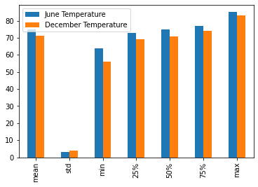

# Temperature analysis

## Overview of the analysis
The purpose of this analysis is to compare the temperature between June and December.

## Results
There're obvious difference between the months (no wonder because we're comparing summer to winter...)

1. The temperature of June is higher than it of December at all the key quantiles (min, 25%, median, 75%, max)
2. The min temperature of June seems to be much higher than it of December (June 64 vs December 56), compared to other quantiles (for example max, June 85 vs December 83), which indicates a narrow range of the temperature of June
3. Perhaps because of same reason of above, the standard deviation of June is lower than December, which means the temperature is less fluctuated in June than December

## Summary
June is warmer than December and the temperature tends to be more stable in June. So... I prefer to summer rather than winter...